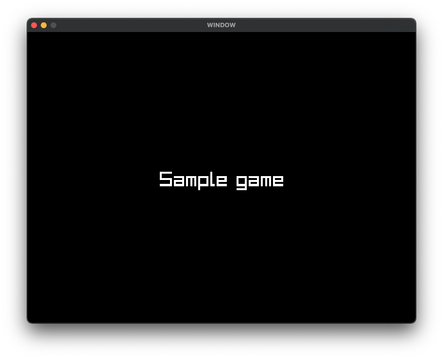

# Splash example

Simple example made with C and raylib for rendering a little splash screen with text
and little game on it

The idea was to code the fadeout and the timer thingy, for that, i added implementations
for concepts such as

- state
- scenes
- timer
- player

## Why?

Idk was just bored and may help someone idk

## Screenshot

